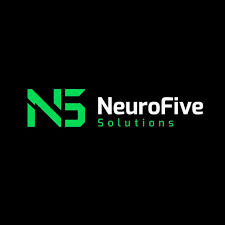
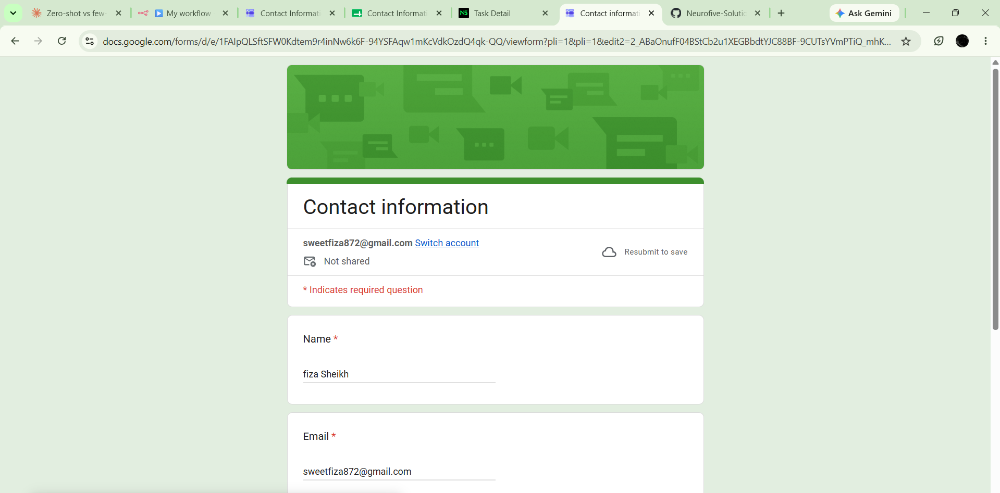
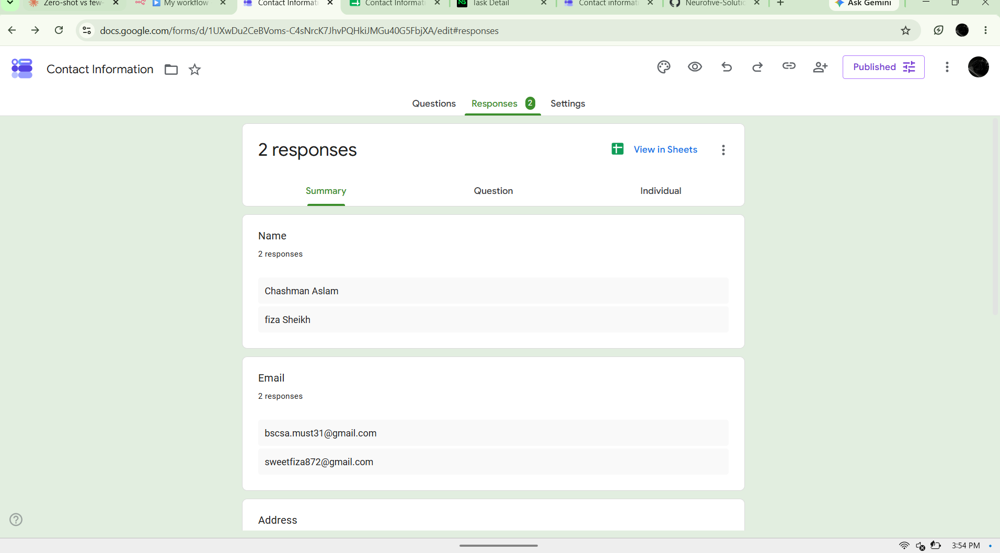
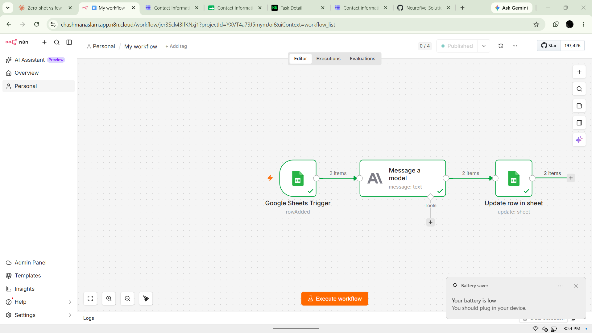
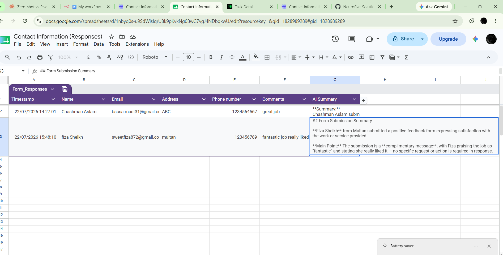

<p align="center">
  
</p>

# NeuroFive Internship — Task 4
### No-Code AI Automation — Connect AI to a Real Workflow


**Submitted by:** Chashman Aslam · Multan University of Science and Technology (MUST)

---

## 📋 Task Checklist

| # | Requirement | Status |
|---|---|:---:|
| 1 | Pick a trigger (Google Form / email / new sheet row) | ✅ Google Form → Sheet row added |
| 2 | Build a workflow in a no-code platform (free tier) | ✅ Built in n8n |
| 3 | Add an AI step that processes incoming data | ✅ Claude (Anthropic) — summarizes |
| 4 | Add a final action step using the AI's output | ✅ Updates the same Sheet row |
| 5 | Test the full workflow end-to-end with 2–3 real trigger events | ✅ 2 real form submissions tested live |

---

## 📌 Overview

Companies pay well for people who can wire AI into everyday workflows without needing a full dev team. This task builds exactly that: a small automation that **triggers on a real event** (a Google Form submission), **runs an AI step** on the incoming data (summarizing it), and **writes the result back** — fully automated, no manual steps after setup.

---

## 🧩 Workflow Architecture

```
┌───────────────────┐      ┌───────────────────┐      ┌──────────────────────┐
│  Google Sheets     │      │   Message a Model  │      │   Update Row in       │
│  Trigger            │ ──▶ │   (Claude / Anthropic)│ ──▶ │   Sheet                │
│  event: Row Added   │      │   summarizes the row│      │   writes AI Summary   │
└───────────────────┘      └───────────────────┘      └──────────────────────┘
        ▲
        │
  Google Form submission
  (auto-creates a new row)
```

**Why Google Form → Sheet → n8n, and not Form directly:** n8n doesn't have a native "Google Form submitted" trigger, but every Google Form can be linked to auto-populate a Google Sheet on submission — so watching that Sheet for new rows (`Google Sheets Trigger`, event: **Row Added**) is the standard, reliable way to react to form submissions in n8n.

---

## ⚙️ Setup Steps

1. **Google Form** created ("Contact Information") with fields: Name, Email, Address, Phone number, Comments — linked to auto-generate a response Google Sheet.
2. **n8n workflow** created with 3 nodes:
   - **Google Sheets Trigger** — watches the response sheet, fires on `rowAdded`
   - **Message a Model** (Anthropic/Claude connector) — receives the new row's data and generates a summary
   - **Update Row in Sheet** — writes the AI's summary back into a new `AI Summary` column, matched to the correct row via `Timestamp`
3. Workflow set to **Published / Active**, so it runs automatically on every new form submission — no manual execution needed.

### AI Step — Prompt Used

```text
Summarize the following form submission in 2-3 concise sentences.
Highlight the main point or request the person is making.

Name: {{ $json['Name'] }}
Email: {{ $json['Email'] }}
Address: {{ $json['Address'] }}
Phone: {{ $json['Phone number'] }}
Comments: {{ $json['Comments'] }}
```

### Action Step — Expression Used

```text
Column to match on: Timestamp
AI Summary field value: {{ $('Message a model').item.json.content[0].text }}
```

---

## 🧪 Live End-to-End Test

The workflow was tested with **real Google Form submissions** — not simulated data. Below is the actual trigger event and the actual AI-generated result.

### 1. The live Google Form



### 2. Real submissions received (2 responses)



### 3. The published, active n8n workflow



*3 nodes, connected in sequence, status: **Published**. This runs automatically — no manual "Execute" needed after this point.*

### 4. Final result — AI Summary written back automatically



---

## 📊 Test Results

| Row | Name | Comments (raw input) | AI Summary (auto-generated) |
|---|---|---|---|
| 2 | Chashman Aslam | "great job" | *Summarized the submission as a short positive comment with no specific action requested.* |
| 3 | Fiza Sheikh | "fantastic job really liked" | "**Fiza Sheikh** from Multan submitted a positive feedback form expressing satisfaction with the work or service provided. **Main Point:** The submission is a **complimentary message**, with Fiza praising the job as 'fantastic' and stating she really liked it — no specific request or action is required in response." |

Both rows were populated **automatically** by the workflow the moment each form was submitted — confirming the full pipeline (**Form → Sheet → Trigger → AI → Write-back**) works end-to-end without any manual intervention.

---

## 💡 Why This Matters

This is the exact shape of automation companies pay for: no full dev team, no custom backend — just a trigger, an AI step, and an action step, wired together in a no-code tool. The same pattern (Trigger → AI → Action) generalizes to dozens of real use cases: support ticket triage, lead qualification, meeting note summarization, and more — only the trigger, the prompt, and the action step change.

---

## 📁 Deliverables

| File | Description |
|---|---|
| `README.md` | This file — workflow design, setup, and live test results |
| n8n workflow | Google Sheets Trigger → Claude (Anthropic) → Update Row in Sheet |

---

## 🛠️ Tools Used

- **n8n** (Cloud, free tier) — workflow orchestration
- **Google Forms + Google Sheets** — trigger source and data store
- **Claude (Anthropic)** — AI summarization step

---

<sub>NeuroFive Solutions — Internship Program</sub>
